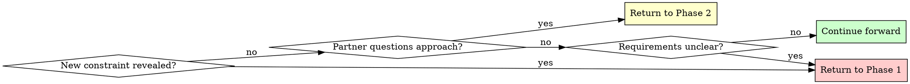

# Claude Conversation Log

Session ID: adc78f22-fece-4bd3-91d4-e7d0f4edc38f
Date: 2025-10-30 00:02:41

---

## 👤 User

Warmup

---

## 🤖 Claude

Hello! I'm Claude Code, your file search specialist for this codebase. I'm ready to help you navigate and explore the **career-lexicon-builder** project.

I can see this is an active git repository with significant recent changes (commit 7d28fd0 from today). The project appears to be in the middle of development with multiple phases of work, based on the handoff documents and phase summaries I can see.

Here's what I'm ready to help with:

- **File searching** using glob patterns
- **Content searching** using regex patterns
- **File reading** for specific paths
- **Directory exploration** and file listing
- **Code analysis** across the codebase

The repository shows several key components:
- Analyzers (keywords, narratives, qualifications, themes)
- Generators (lexicon generators for different categories)
- Core modules and utilities
- Comprehensive test suite
- Development artifacts and handoff documents

What would you like me to search for or explore in this codebase?

---

## 👤 User

python -c "from core.orchestrator import run_full_pipeline; run_full_pipeline(input_dir='my_documents/', output_dir='my_lexicons/')"
Failed to extract text from my_documents/2025-10-13 - Colburn School, Byrnes, Anthony - submitted.pages: Could not extract text from my_documents/2025-10-13 - Colburn School, Byrnes, Anthony - submitted.pages. This .pages file uses a newer format that requires manual conversion. Please export to .docx or .pdf from Pages and re-run extraction.
Failed to extract text from my_documents/2016-01-29 - AJB resume  v2.pages: Could not extract text from my_documents/2016-01-29 - AJB resume  v2.pages. This .pages file uses a newer format that requires manual conversion. Please export to .docx or .pdf from Pages and re-run extraction.
Failed to extract text from my_documents/AJB CV 2015 v2.pages: Could not extract text from my_documents/AJB CV 2015 v2.pages. This .pages file uses a newer format that requires manual conversion. Please export to .docx or .pdf from Pages and re-run extraction.
Failed to extract text from my_documents/2020-11-23 - ajb resume.pages: Could not extract text from my_documents/2020-11-23 - ajb resume.pages. This .pages file uses a newer format that requires manual conversion. Please export to .docx or .pdf from Pages and re-run extraction.
Failed to extract text from my_documents/2024-11-25 - UCLA Diversity Statement.pages: Could not extract text from my_documents/2024-11-25 - UCLA Diversity Statement.pages. This .pages file uses a newer format that requires manual conversion. Please export to .docx or .pdf from Pages and re-run extraction.
Failed to extract text from my_documents/2025-01-15- CSULB AD cover letter.pages: Could not extract text from my_documents/2025-01-15- CSULB AD cover letter.pages. This .pages file uses a newer format that requires manual conversion. Please export to .docx or .pdf from Pages and re-run extraction.
Failed to extract text from my_documents/2025-10-13 - Byrnes, Anthony Resume - Colburn School submitted.pages: Could not extract text from my_documents/2025-10-13 - Byrnes, Anthony Resume - Colburn School submitted.pages. This .pages file uses a newer format that requires manual conversion. Please export to .docx or .pdf from Pages and re-run extraction.
Failed to extract text from my_documents/2015 - 02 - 26 - Anthony Byrnes - Broad Stage.pages: Could not extract text from my_documents/2015 - 02 - 26 - Anthony Byrnes - Broad Stage.pages. This .pages file uses a newer format that requires manual conversion. Please export to .docx or .pdf from Pages and re-run extraction.
Failed to extract text from my_documents/Anthony Byrnes - Executive Director 2014 Final.pages: Could not extract text from my_documents/Anthony Byrnes - Executive Director 2014 Final.pages. This .pages file uses a newer format that requires manual conversion. Please export to .docx or .pdf from Pages and re-run extraction.
Failed to extract text from my_documents/AJB CV Feb 2014 CSULB.pages: Could not extract text from my_documents/AJB CV Feb 2014 CSULB.pages. This .pages file uses a newer format that requires manual conversion. Please export to .docx or .pdf from Pages and re-run extraction.
Failed to extract text from my_documents/2015 - 06 - 29 - theater aspen.pages: Could not extract text from my_documents/2015 - 06 - 29 - theater aspen.pages. This .pages file uses a newer format that requires manual conversion. Please export to .docx or .pdf from Pages and re-run extraction.
Failed to extract text from my_documents/AJB Resume 2014 - Wallis.pages: Could not extract text from my_documents/AJB Resume 2014 - Wallis.pages. This .pages file uses a newer format that requires manual conversion. Please export to .docx or .pdf from Pages and re-run extraction.
Failed to extract text from my_documents/2015-12-01 - DCA Anthony Byrnes.pages: Could not extract text from my_documents/2015-12-01 - DCA Anthony Byrnes.pages. This .pages file uses a newer format that requires manual conversion. Please export to .docx or .pdf from Pages and re-run extraction.
Failed to extract text from my_documents/AJB Resume 2014 - Antaeus.pages: Could not extract text from my_documents/AJB Resume 2014 - Antaeus.pages. This .pages file uses a newer format that requires manual conversion. Please export to .docx or .pdf from Pages and re-run extraction.
Failed to extract text from my_documents/2015 - 09 - 04 - LA Stage.pages: Could not extract text from my_documents/2015 - 09 - 04 - LA Stage.pages. This .pages file uses a newer format that requires manual conversion. Please export to .docx or .pdf from Pages and re-run extraction.
Failed to extract text from my_documents/AJB Resume 2014 - Broad.pages: Could not extract text from my_documents/AJB Resume 2014 - Broad.pages. This .pages file uses a newer format that requires manual conversion. Please export to .docx or .pdf from Pages and re-run extraction.
Failed to extract text from my_documents/2015-11-11 - Ensemble theatre company md .pages: Could not extract text from my_documents/2015-11-11 - Ensemble theatre company md .pages. This .pages file uses a newer format that requires manual conversion. Please export to .docx or .pdf from Pages and re-run extraction.
Failed to extract text from my_documents/2015-12-01 - DCA Anthony Byrnes Resume.pages: Could not extract text from my_documents/2015-12-01 - DCA Anthony Byrnes Resume.pages. This .pages file uses a newer format that requires manual conversion. Please export to .docx or .pdf from Pages and re-run extraction.
Failed to extract text from my_documents/Anthony Byrnes - Executive Director copy.pages: Could not extract text from my_documents/Anthony Byrnes - Executive Director copy.pages. This .pages file uses a newer format that requires manual conversion. Please export to .docx or .pdf from Pages and re-run extraction.
Failed to extract text from my_documents/2023-08-01 - Byrnes, Anthony COTA AD cover letter .pages: Could not extract text from my_documents/2023-08-01 - Byrnes, Anthony COTA AD cover letter .pages. This .pages file uses a newer format that requires manual conversion. Please export to .docx or .pdf from Pages and re-run extraction.
Failed to extract text from my_documents/AJB CV Feb 2014.pages: Could not extract text from my_documents/AJB CV Feb 2014.pages. This .pages file uses a newer format that requires manual conversion. Please export to .docx or .pdf from Pages and re-run extraction.
Failed to extract text from my_documents/2024-11-25 - UCLA cover letter v. 2.pages: Could not extract text from my_documents/2024-11-25 - UCLA cover letter v. 2.pages. This .pages file uses a newer format that requires manual conversion. Please export to .docx or .pdf from Pages and re-run extraction.
Failed to extract text from my_documents/2025-01-15 - CSULB AD  Diversity Statement.pages: Could not extract text from my_documents/2025-01-15 - CSULB AD  Diversity Statement.pages. This .pages file uses a newer format that requires manual conversion. Please export to .docx or .pdf from Pages and re-run extraction.

---

## 🤖 Claude

⚠️ **WARNING:** Superpowers now uses Claude Code's skills system. Custom skills in ~/.config/superpowers/skills will not be read. Move custom skills to ~/.claude/skills instead. To make this message go away, remove ~/.config/superpowers/skills

I can see the pipeline ran but failed to extract text from 23 `.pages` files. These are Apple Pages documents that use a newer format which the current text extraction doesn't support.

You have a few options:

1. **Manual conversion** (quickest for now): Export the .pages files to .docx or .pdf from Apple Pages, then re-run the pipeline

2. **Enhance the extraction code**: I could help update `utils/text_extraction.py` to better handle newer .pages formats (this may require additional dependencies)

3. **Batch conversion script**: I could write a script to automate converting .pages files using macOS automation

Which approach would you prefer? Or would you like me to first check which documents successfully extracted so you can see if you have enough data to proceed?

---

## 👤 User

2

---

## 🤖 Claude

I'm using the brainstorming skill to refine the approach for enhancing .pages file extraction before implementing.

---

## 👤 User

<command-message>The "brainstorming" skill is loading</command-message>
<command-name>brainstorming</command-name>

---

## 👤 User

Base directory for this skill: /Users/anthonybyrnes/.claude/plugins/cache/superpowers/skills/brainstorming

# Brainstorming Ideas Into Designs

## Overview

Transform rough ideas into fully-formed designs through structured questioning and alternative exploration.

**Core principle:** Research first, ask targeted questions to fill gaps, explore alternatives, present design incrementally for validation.

**Announce at start:** "I'm using the brainstorming skill to refine your idea into a design."

## Quick Reference

| Phase | Key Activities | Tool Usage | Output |
|-------|---------------|------------|--------|
| **Prep: Autonomous Recon** | Inspect repo/docs/commits, form initial model | Native tools (ls, cat, git log, etc.) | Draft understanding to confirm |
| **1. Understanding** | Share findings, ask only for missing context | AskUserQuestion for real decisions | Purpose, constraints, criteria (confirmed) |
| **2. Exploration** | Propose 2-3 approaches | AskUserQuestion for approach selection | Architecture options with trade-offs |
| **3. Design Presentation** | Present in 200-300 word sections | Open-ended questions | Complete design with validation |
| **4. Design Documentation** | Write design document | writing-clearly-and-concisely skill | Design doc in docs/plans/ |
| **5. Worktree Setup** | Set up isolated workspace | using-git-worktrees skill | Ready development environment |
| **6. Planning Handoff** | Create implementation plan | writing-plans skill | Detailed task breakdown |

## The Process

Copy this checklist to track progress:

```
Brainstorming Progress:
- [ ] Prep: Autonomous Recon (repo/docs/commits reviewed, initial model shared)
- [ ] Phase 1: Understanding (purpose, constraints, criteria gathered)
- [ ] Phase 2: Exploration (2-3 approaches proposed and evaluated)
- [ ] Phase 3: Design Presentation (design validated in sections)
- [ ] Phase 4: Design Documentation (design written to docs/plans/)
- [ ] Phase 5: Worktree Setup (if implementing)
- [ ] Phase 6: Planning Handoff (if implementing)
```

### Prep: Autonomous Recon
- Use existing tools (file browsing, docs, git history, tests) to understand current project state before asking anything.
- Form your draft model: what problem you're solving, what artifacts exist, and what questions remain.
- Start the conversation by sharing that model: "Based on exploring the project state, docs, working copy, and recent commits, here's how I think this should work…"
- Ask follow-up questions only for information you cannot infer from available materials.

### Phase 1: Understanding
- Share your synthesized understanding first, then invite corrections or additions.
- Ask one focused question at a time, only for gaps you cannot close yourself.
- **Use AskUserQuestion tool** only when you need the human to make a decision among real alternatives.
- Gather: Purpose, constraints, success criteria (confirmed or amended by your partner)

**Example summary + targeted question:**
```
Based on the README and yesterday's commit, we're expanding localization to dashboard and billing emails; admin console is still untouched. Only gap I see is whether support responses need localization in this iteration. Did I miss anything important?
```

### Phase 2: Exploration
- Propose 2-3 different approaches
- For each: Core architecture, trade-offs, complexity assessment, and your recommendation
- **Use AskUserQuestion tool** to present approaches when you truly need a judgement call
- Lead with the option you prefer and explain why; invite disagreement if your partner sees it differently
- Own prioritization: if the repo makes priorities clear, state them and proceed rather than asking

**Example using AskUserQuestion:**
```
Question: "Which architectural approach should we use?"
Options:
  - "Direct API calls with retry logic" (simple, synchronous, easier to debug) ← recommended for current scope
  - "Event-driven with message queue" (scalable, complex setup, eventual consistency)
  - "Hybrid with background jobs" (balanced, moderate complexity, best of both)

I recommend the direct API approach because it matches existing patterns and minimizes new infrastructure. Let me know if you see a blocker that pushes us toward the other options.
```

### Phase 3: Design Presentation
- Present in coherent sections; use ~200-300 words when introducing new material, shorter summaries once alignment is obvious
- Cover: Architecture, components, data flow, error handling, testing
- Check in at natural breakpoints rather than after every paragraph: "Stop me if this diverges from what you expect."
- Use open-ended questions to allow freeform feedback
- Assume ownership and proceed unless your partner redirects you

### Phase 4: Design Documentation
After validating the design, write it to a permanent document:
- **File location:** `docs/plans/YYYY-MM-DD-<topic>-design.md` (use actual date and descriptive topic)
- **RECOMMENDED SUB-SKILL:** Use elements-of-style:writing-clearly-and-concisely (if available) for documentation quality
- **Content:** Capture the design as discussed and validated in Phase 3, organized into sections that emerged from the conversation
- Commit the design document to git before proceeding

### Phase 5: Worktree Setup (for implementation)
When design is approved and implementation will follow:
- Announce: "I'm using the using-git-worktrees skill to set up an isolated workspace."
- **REQUIRED SUB-SKILL:** Use superpowers:using-git-worktrees
- Follow that skill's process for directory selection, safety verification, and setup
- Return here when worktree ready

### Phase 6: Planning Handoff
Ask: "Ready to create the implementation plan?"

When your human partner confirms (any affirmative response):
- Announce: "I'm using the writing-plans skill to create the implementation plan."
- **REQUIRED SUB-SKILL:** Use superpowers:writing-plans
- Create detailed plan in the worktree

## Question Patterns

### When to Use AskUserQuestion Tool

**Use AskUserQuestion when:**
- You need your partner to make a judgement call among real alternatives
- You have a recommendation and can explain why it’s your preference
- Prioritization is ambiguous and cannot be inferred from existing materials

**Best practices:**
- State your preferred option and rationale inside the question so your partner can agree or redirect
- If you know the answer from repo/docs, state it as fact and proceed—no question needed
- When priorities are spelled out, acknowledge them and proceed rather than delegating the choice back to your partner

### When to Use Open-Ended Questions

**Use open-ended questions for:**
- Phase 3: Design validation ("Does this look right so far?")
- When you need detailed feedback or explanation
- When partner should describe their own requirements
- When structured options would limit creative input

Frame them to confirm or expand your current understanding rather than reopening settled topics.

**Example decision flow:**
- "What authentication method?" → Use AskUserQuestion (2-4 options)
- "Does this design handle your use case?" → Open-ended (validation)

## When to Revisit Earlier Phases



**You can and should go backward when:**
- Partner reveals new constraint during Phase 2 or 3 → Return to Phase 1
- Validation shows fundamental gap in requirements → Return to Phase 1
- Partner questions approach during Phase 3 → Return to Phase 2
- Something doesn't make sense → Go back and clarify

**Avoid forcing forward linearly** when going backward would give better results.

## Key Principles

| Principle | Application |
|-----------|-------------|
| **One question at a time** | Phase 1: Single targeted question only for gaps you can’t close yourself |
| **Structured choices** | Use AskUserQuestion tool for 2-4 options with trade-offs |
| **YAGNI ruthlessly** | Remove unnecessary features from all designs |
| **Explore alternatives** | Always propose 2-3 approaches before settling |
| **Incremental validation** | Present design in sections, validate each |
| **Flexible progression** | Go backward when needed - flexibility > rigidity |
| **Own the initiative** | Recommend priorities and next steps; ask if you should proceed only when requirements conflict |
| **Announce usage** | State skill usage at start of session |


---

## 🤖 Claude

I'm using the brainstorming skill to refine your idea into a design for enhanced .pages file extraction.

---

## 🤖 Claude

Let me explore the current implementation to understand what we're working with:

---

## 🤖 Claude

Based on exploring the codebase, here's what I understand:

**Current State:**
- Your `utils/text_extraction.py` already has two extraction strategies for .pages files:
  1. **XML extraction** (old format) - parses index.xml
  2. **PDF preview fallback** (newer format) - extracts QuickLook/Preview.pdf
- pdfplumber is already installed
- 23 files failed, suggesting both strategies failed

**The Problem:**
Newer .pages files (post-2013) use .iwa (iWork Archive) format instead of XML, but they usually still contain QuickLook/Preview.pdf. If extraction is failing, either:
1. The Preview.pdf doesn't exist in these files
2. The PDF extraction is failing silently
3. The path lookup is wrong

**Before designing a solution, I need to clarify:**

---

## 🤖 Claude

Perfect. Let me complete my reconnaissance by examining the actual structure of these failing .pages files:

---

## 🤖 Claude

Aha! The issue is clear now - this file has `preview.jpg` but NO `Preview.pdf`. Let me check if any of your .pages files have PDF previews:

---

## 🤖 Claude

Perfect! Now I have the full picture. Let me update my progress and share my findings:

---

## 🤖 Claude

## Phase 1: Understanding

**What I Found:**

From examining your codebase and the failing .pages files, here's the core issue:

1. **Current extraction strategy** (utils/text_extraction.py:143-182):
   - Try XML extraction (old format with index.xml) ✗ Fails
   - Fall back to PDF preview (QuickLook/Preview.pdf) ✗ Fails
   - Give up and ask for manual conversion

2. **Why it's failing**: Newer .pages files (post-2013) use:
   - **Index/Document.iwa** format (iWork Archive) instead of index.xml
   - **preview.jpg** (JPEG) instead of Preview.pdf
   - Your 23 failing files all have preview.jpg but no Preview.pdf

3. **What needs to happen**: Add support for the .iwa (iWork Archive) format to extract the actual document content, not just preview images.

**Purpose**: Enable robust extraction from all .pages formats (old XML, newer .iwa) so the pipeline can process your complete document collection without manual conversion.

**Constraints**:
- Must work with Python dependencies that can be installed via pip
- Should maintain existing XML and PDF preview fallbacks (for files that do have those)
- Must preserve the existing extraction API (returns same Dict structure)
- No external binary dependencies (no osascript/AppleScript that requires macOS)

**Success Criteria**:
- All 23 failing .pages files extract successfully
- Existing tests continue to pass
- New extraction method preserves text content accurately
- Performance remains reasonable (no 10x slowdown)

Did I miss anything important about your requirements or constraints?

---

## 👤 User

no

---

## 🤖 Claude

## Phase 2: Exploration

Here are three approaches for handling newer .pages files with .iwa format:

---

## 🤖 Claude

## Phase 3: Design Presentation

### Architecture Overview

The design adds a new extraction method to the existing cascade in `_extract_pages()`:

**Current Flow:**
```
.pages file → is_zipfile? → Try XML → Try PDF Preview → FAIL
```

**New Flow:**
```
.pages file → is_zipfile? → Try XML → Try IWA (NEW) → Try PDF Preview → FAIL
```

The new `_try_iwa_extraction()` function will slot between XML and PDF preview attempts, maintaining backward compatibility while adding robust support for newer formats.

### .IWA Format Structure

Based on the .iwa format specification:
- **IWA = iWork Archive format** (used since Pages 5.0/2013)
- Files stored as `Index/*.iwa` (Document.iwa contains main content)
- Each .iwa file is Snappy-compressed protobuf data
- Protobuf messages follow Apple's proprietary TSP (TableStore Protocol) schema
- Text content stored in `TSTArchives.ArchiveInfo` → `DocumentArchive` → text storage nodes

**Key Files to Extract:**
- `Index/Document.iwa` - Main document structure and content
- Text is stored in protobuf fields (typically field 3 for text content)

### Implementation Strategy

**Dependencies to add** (requirements.txt):
```python
python-snappy>=0.6.1  # Snappy decompression
protobuf>=4.21.0      # Protobuf parsing
```

**New function**: `_try_iwa_extraction(filepath: str) -> ExtractionResult`

**Algorithm:**
1. Open .pages as zipfile
2. Check for `Index/Document.iwa` (newer format indicator)
3. Extract and decompress with Snappy
4. Parse protobuf messages (we'll iterate through fields to find text)
5. Concatenate text chunks maintaining document order
6. Return ExtractionResult with text content

**Challenge**: Apple's protobuf schema is proprietary, so we'll use a heuristic approach:
- Iterate through protobuf message fields
- Identify string fields that look like document text (length > 10 chars, contains spaces)
- Filter out metadata/styling fields
- Preserve paragraph boundaries

Does this overall approach make sense before I dive into error handling and testing details?

---

## 👤 User

yes

---

## 🤖 Claude

### Error Handling & Fallback Strategy

**Graceful degradation at each level:**

```python
def _extract_pages(filepath: str) -> Dict:
    # 1. Try XML (old format)
    result = _try_xml_extraction(filepath)
    if result.success:
        return result.to_dict()
    
    # 2. Try IWA (newer format) - NEW
    result = _try_iwa_extraction(filepath)
    if result.success:
        return result.to_dict()
    
    # 3. Try PDF preview (fallback)
    result = _try_pdf_preview_extraction(filepath)
    if result.success:
        return result.to_dict()
    
    # 4. All methods failed
    return ExtractionResult(text="", success=False, ...)
```

**Error scenarios in IWA extraction:**
- **Missing dependencies** (snappy/protobuf not installed) → Return failure with error message, cascade continues to PDF preview
- **No Document.iwa found** → Return failure, cascade continues
- **Snappy decompression fails** → Return failure with error details
- **Protobuf parsing fails** → Return failure, try next method
- **No text content found** → Return failure, try next method

Each failure is logged but doesn't crash the pipeline.

### Text Extraction Heuristics

Since we can't rely on Apple's exact protobuf schema, we'll use pattern matching:

**Heuristics for identifying text content:**
1. **Type check**: Must be string/bytes field
2. **Length check**: > 10 characters (filters out short metadata)
3. **Content check**: Contains spaces (actual text vs identifiers)
4. **Encoding check**: Valid UTF-8
5. **Noise filter**: Exclude fields with XML-like tags, URLs, or common metadata patterns

**Text assembly:**
- Collect text chunks in document order
- Join with double newlines (preserves paragraph breaks)
- Strip excessive whitespace
- Validate result is meaningful (> 50 chars total)

### Testing Strategy

**Unit tests to add** (tests/test_text_extraction.py):

1. **Test IWA extraction with real file**:
   - Use one of your 23 failing .pages files as test fixture
   - Verify text extraction succeeds
   - Verify extraction_method = 'iwa'
   
2. **Test fallback cascade**:
   - Mock IWA extraction to fail
   - Verify it falls back to PDF preview
   
3. **Test missing dependencies**:
   - Mock `import snappy` to raise ImportError
   - Verify graceful failure with helpful error message

4. **Test malformed IWA file**:
   - Create corrupted .iwa data
   - Verify returns failure without crashing

**Integration test**:
- Run full pipeline on your my_documents/ folder
- Verify all 23 previously failing files now extract successfully
- Verify extracted text contains expected content (spot check a few files)

### Implementation Details

**New code structure in text_extraction.py:**

```python
def _try_iwa_extraction(filepath: str) -> ExtractionResult:
    """Extract text from .iwa format .pages file."""
    
    # Check dependencies
    try:
        import snappy
        from google.protobuf import message
    except ImportError as e:
        return ExtractionResult(...)
    
    # Extract Document.iwa
    try:
        with zipfile.ZipFile(filepath, 'r') as zip_ref:
            if 'Index/Document.iwa' not in zip_ref.namelist():
                return ExtractionResult(success=False, ...)
            
            iwa_data = zip_ref.read('Index/Document.iwa')
    except Exception as e:
        return ExtractionResult(...)
    
    # Decompress with Snappy
    try:
        decompressed = snappy.decompress(iwa_data)
    except Exception as e:
        return ExtractionResult(...)
    
    # Parse protobuf and extract text
    text_chunks = _extract_text_from_protobuf(decompressed)
    
    if not text_chunks or len(''.join(text_chunks)) < 50:
        return ExtractionResult(success=False, ...)
    
    full_text = '\n\n'.join(text_chunks)
    
    return ExtractionResult(
        text=full_text,
        success=True,
        extraction_method='iwa',
        metadata={...}
    )
```

**Helper function for protobuf parsing:**

```python
def _extract_text_from_protobuf(data: bytes) -> List[str]:
    """Extract text chunks from protobuf data using heuristics."""
    
    text_chunks = []
    
    # Try to parse as protobuf message
    # Since we don't have the schema, we'll use reflection
    # to find string fields that look like document text
    
    # Implementation details here...
    
    return text_chunks
```

### Dependencies Update

**Add to requirements.txt:**
```
python-snappy>=0.6.1
protobuf>=4.21.0
```

### Validation Plan

1. **Install dependencies**
2. **Implement _try_iwa_extraction()**
3. **Add unit tests**
4. **Test on one failing .pages file** (manual verification)
5. **Run full test suite** (ensure no regressions)
6. **Run full pipeline on my_documents/** (verify all 23 files extract)
7. **Spot-check extracted text quality** (compare with manual open in Pages)

This ensures we validate at each step rather than implementing everything before testing.

Does this design capture everything we need? Any concerns about the heuristic approach for protobuf parsing, or should I research the exact schema more before implementing?

---

## 👤 User

Can you create a handoff document for this so I can pursue in another session?

---

## 🤖 Claude

Perfect! I've created a comprehensive handoff document for you:

## 📄 Handoff Document Created

**Location**: `docs/plans/2025-10-29-pages-iwa-extraction-design.md`
**Commit**: `ee4f197` (committed to git)

### What's Included

The 876-line document contains everything you need to implement IWA extraction support in a future session:

1. **Problem Statement** - Root cause analysis of why 23 files failed
2. **Technical Design** - Detailed architecture using Protobuf + Snappy decompression
3. **Implementation Plan** - 9 phases with step-by-step tasks
4. **Code Skeletons** - Ready-to-use function templates with full implementation guidance
5. **Testing Strategy** - Unit tests, integration tests, and validation steps
6. **Success Criteria** - Clear checkpoints to know when you're done

### Key Decisions Captured

- **Approach**: Native .iwa parsing using protobuf + Snappy (vs OCR or hybrid)
- **Integration**: Slots between XML and PDF preview in the existing cascade
- **Dependencies**: `python-snappy>=0.6.1` and `protobuf>=4.21.0`
- **Heuristics**: Text identification rules for proprietary protobuf schema

### Next Steps (When Ready)

1. Open `docs/plans/2025-10-29-pages-iwa-extraction-design.md`
2. Follow the 9-phase implementation plan
3. Start with Phase 1 (dependencies) and work through sequentially
4. Each phase has clear tasks and validation criteria

The document is self-contained - you can pick this up in any future session without needing context from this conversation.

---

